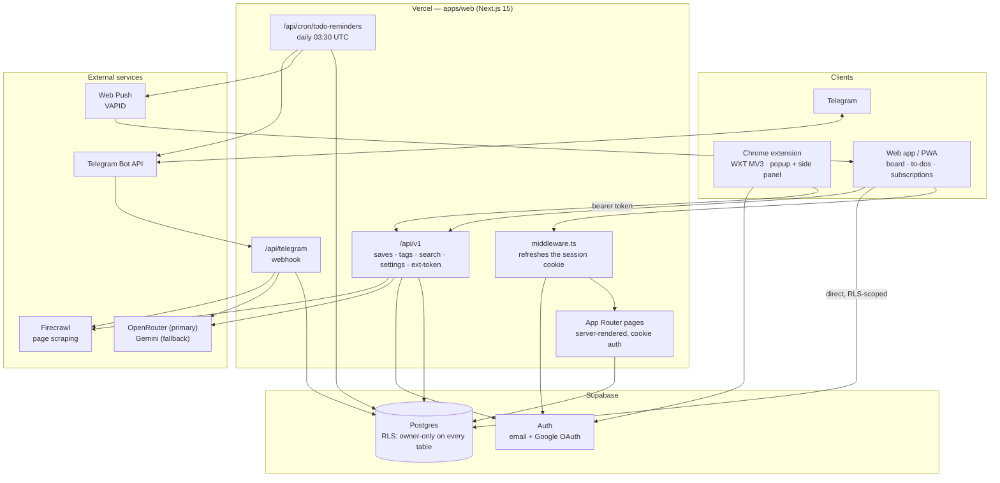
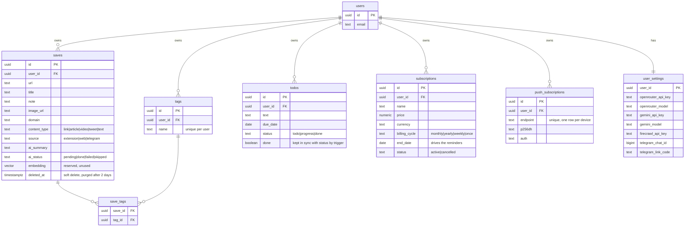

# Recall

**Save anything, remember everything.** Cross-platform link memory — Chrome extension, installable PWA, and Telegram bot, all feeding one library. AI summarizes and auto-tags every save, with Firecrawl web scraping pulling real page content for smarter results. Search it later, or just ask the bot.

    

## How it works



There is no separate backend or bot service — the API, the Telegram webhook and the cron are all Next.js route handlers in `apps/web`, and the web app is itself the PWA. Pages and the browser client talk to Postgres directly under row-level security; only the webhook and cron use the service-role key, because they run without a user session.

Every save goes through the same pipeline: store instantly → enrich in the background (scrape page text if thin → summarize → auto-tag) → card appears in the library with a 2-sentence summary and 3–5 tags that converge instead of fragmenting.

## Data model

Every table is scoped to its owner by row-level security. `auth.users` is Supabase's own table; everything else is ours.



Two tables sit outside that graph: `app_settings` is a single-row table holding the Telegram bot token and webhook secret, and `telegram_links` is legacy — account linking actually lives in `user_settings.telegram_chat_id`.

`todos.done` and `todos.status` both exist on purpose: the web UI cycles the three-state `status`, the bot and cron read the boolean `done`, and a trigger keeps them agreeing.

## Features

- **Chrome extension** (WXT, Manifest V3) — one-click save with optional note; side panel shows your whole library with search and filters without leaving the page
- **Web app** (Next.js 15, App Router) — card grid, keyword search, tag/type/source filter chips; installable as a **PWA** with offline shell and custom install prompt
- **AI enrichment** — tight summary + tags per save, with a resilient fallback chain:
  1. your OpenRouter key + model (primary)
  2. your Gemini key + model (fallback)
  3. server default chain of free models
- **To-dos** — three-state tasks (to-do → progress → done) with due dates, on the site or from the bot
- **Subscriptions** — track what you pay for and when it ends; add them on the site, or just tell the bot *"netflix ends 5th august 499rs monthly"* and it files the name, price, currency, cycle and date
- **Reminders** — one daily job covers to-dos due or overdue and subscriptions ending within three days, delivered over Telegram and **Web Push** (install the PWA and enable it per device; on iPhone, add to home screen first)
- **Board layouts** — masonry showcase, compact list, image grid, or dense text cubes, remembered per browser
- **Telegram bot** — send any link to save it; ask natural-language questions about your saves; `/recent`, `/search <words>`, `/todos`, `/subs`, `/link <code>` to connect your account
- **Firecrawl scraping** (optional) — when a page has thin or no text (Telegram saves, JS-heavy or blocked pages), Firecrawl fetches the real content so summaries stay sharp
- **Bring your own keys** — OpenRouter, Gemini, Firecrawl, and the Telegram bot token are all entered on the in-app Settings page and stored per user. No redeploys, no dashboard env editing, each key has a **Test** button.
- **Private by design** — Supabase row-level security scopes every row to its owner; API keys are never sent back to the client (only "a key is saved" flags)

## Repo layout

```
apps/web           Next.js 15 site + all API routes (/api/v1, /api/telegram)
apps/extension     WXT + React Chrome extension (popup, side panel, background)
packages/types     shared zod schemas (Save, EnrichResult, ...)
supabase/          SQL migrations — Postgres schema + RLS policies
```

pnpm workspaces monorepo. AI calls go through the Vercel AI SDK so providers are swappable.

## Self-hosting

Everything runs on free tiers: Vercel, Supabase, OpenRouter free models, Gemini free key, Firecrawl free tier.

### 1. Supabase

Create a project at [supabase.com](https://supabase.com), then run each file in `supabase/migrations/` in order (Dashboard → SQL editor, or `supabase db push`). Enable the auth providers you want (email works out of the box; Google OAuth optional).

### 2. Environment

Copy `.env.example` → `apps/web/.env.local`:

| Variable | Where to get it | Required |
|---|---|---|
| `NEXT_PUBLIC_SUPABASE_URL` | Supabase → Settings → API | yes |
| `NEXT_PUBLIC_SUPABASE_ANON_KEY` | same page (safe for clients, RLS enforces access) | yes |
| `SUPABASE_SERVICE_ROLE_KEY` | same page — **server-only, never expose** | yes |
| `OPENROUTER_API_KEY` | [openrouter.ai/keys](https://openrouter.ai/keys) | no — users can add their own in Settings |
| `FIRECRAWL_API_KEY` | [firecrawl.dev](https://firecrawl.dev) | no — same |
| `NEXT_PUBLIC_VAPID_PUBLIC_KEY` | `npx web-push generate-vapid-keys` | only for push notifications |
| `VAPID_PRIVATE_KEY` | same command — **server-only** | only for push notifications |
| `VAPID_SUBJECT` | `mailto:you@example.com` | only for push notifications |
| `CRON_SECRET` | any random string; Vercel sends it as a bearer token | recommended — without it the reminder cron is publicly callable |

Without the VAPID keys push silently does nothing (Telegram reminders still work), so a missing value looks like "notifications just never arrive" rather than an error.

### 3. Web app

```bash
pnpm install
pnpm --filter @recall/web dev        # local
```

Deploy: import the repo into [Vercel](https://vercel.com), set root to `apps/web`, add the env vars above. The Telegram webhook URL derives itself from the request — no app-URL env var needed.

### 4. Chrome extension

```bash
# apps/extension/.env
WXT_API_BASE_URL=https://<your-app>.vercel.app/api/v1
WXT_SUPABASE_URL=<same as NEXT_PUBLIC_SUPABASE_URL>
WXT_SUPABASE_ANON_KEY=<same as anon key>
```

```bash
pnpm --filter extension build
```

Load `apps/extension/.output/chrome-mv3` via `chrome://extensions` → Developer mode → Load unpacked.

### 5. Telegram bot (optional)

1. Create a bot with [@BotFather](https://t.me/BotFather), copy the token
2. Paste it on the app's **Settings** page → Register — the webhook registers itself
3. Generate a link code in Settings, send `/link <code>` to your bot. Done — send it any link.

## Configuration in the app

Settings page (no redeploys, per-user):

- **OpenRouter** (primary) — key + model, free-model hints included
- **Google Gemini** (fallback) — key + model
- **Firecrawl** — key for page scraping
- **Telegram** — bot token registration + account linking

Every provider card has a **Test API** button that fires a real call and reports latency.

## License

[MIT](LICENSE)
